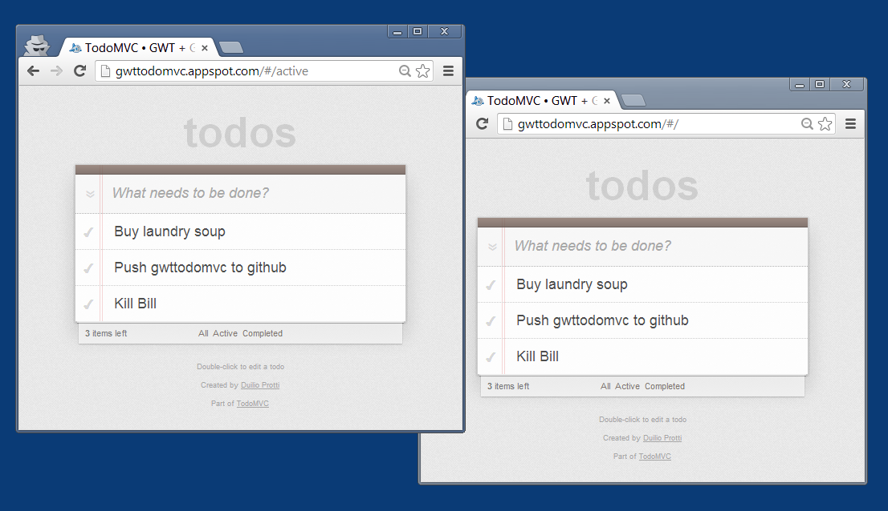

# Google Web Toolkit TodoMVC with Real Time Collab

This is [TodoMVC](http://todomvc.com) app supporting real-time collaboration.
When a user adds, modifies or removes a task, the change is reflected in real-time in all other browsers.

It's a sample implementation applying the [Command Pattern](http://en.wikipedia.org/wiki/Command_pattern) using Google Web Toolkit ([GWT](http://www.gwtproject.org/))
and AppEngine [Channel API](https://developers.google.com/appengine/docs/java/channel/).

- To understand the approach please listen to Justin Fagnani on this 10 minutes [presentation](http://www.youtube.com/watch?v=wWhd9ZwvCyw&t=29m44s)
- Read the [annotated source code](http://dprotti.github.io/todomvc-gwtgaechannel/)
- Try the **[live demo](http://gwttodomvc.appspot.com)**



## Folder Structure

```
├── gwt_gaechannel (the app itself written in Java using GWT)
└── rpc-manifest-builder (Java program for generating the RPC policy file used in serialization of commands sent between clients <-> server)
```

## Snippets

From `server.service.CommandServiceImpl.java`:

```java
// This method executes commands on the server and then broadcasts the command
// to all listening clients. ChannelService.sendMessage is from GAE Channel API.
@Override
public Command<?> executeCommand(Command<?> command, String originClientId) {
    Command<?> updateCommand = executor.execute(command);
    String commandMessage = serializer.serializeCommand(updateCommand);
    checkState(!editors.isEmpty(), "There must be at least one editing client");
    for (String editor : editors) {
        if (!editor.equals(originClientId)) {
            channelService.sendMessage(new ChannelMessage(editor, commandMessage));
        }
    }
    return updateCommand;
}
```

Client receives command by `client.command.CommandController.java`:

```java
private class CommandChannelListener implements SocketListener {

    @Override
    public void onOpen() {
        logger.info("channel open");
    }

    @Override
    public void onMessage(String message) {
        try {
            Command<?> command = deserializer.read(message);
            logger.fine("received command: " + command);
            executor.execute(command);
        } catch (CommandSerialization.SerializationException e) {
            logger.severe("unable to de-serialize message: " + message);
        }
    }

    @Override
    public void onError(ChannelError error) {
        logger.severe("channel error: " + error.getCode() + " : " + error.getDescription());
    }

    @Override
    public void onClose() {
        logger.severe("channel closed: will not receive further commands from the server");
    }
}
```

[client](http://dprotti.github.io/todomvc-gwtgaechannel/java/com/todomvc/client/command/todo/ClientToDoCommandExecutor.java.html) and [server](http://dprotti.github.io/todomvc-gwtgaechannel/java/com/todomvc/server/command/todo/ServerToDoCommandExecutor.java.html) executors are two implementations of the same interface: they differ in how they load objects.

[CommandController](http://dprotti.github.io/todomvc-gwtgaechannel/java/com/todomvc/client/command/CommandController.java.html) also sends commands to the server:

```java
    public void executeCommand(Command<?> command) {
        if (command.isEager()) {
            executeCommandOnClient(command);
        }
        sendCommandToServer(command);
    }

    private void executeCommandOnClient(Command<?> command) {
        executor.execute(command);
    }

    private void sendCommandToServer(final Command<?> command) {
        commandService.executeCommand(command, clientId, new AsyncCallback<Command<?>>() {

            @Override
            public void onFailure(Throwable caught) {
                logger.severe("error sending command to server: " + caught.getLocalizedMessage());
            }

            @Override
            public void onSuccess(Command<?> updateCommand) {
                if (!command.isEager()) {
                    executor.execute(updateCommand);
                }
            }
        });
    }
```

## Run Locally
From command line (requires Maven 3 and JDK >= 6):

    $ git clone https://github.com/dprotti/todomvc.git
    $ cd todomvc/labs/architecture-examples/gwt-gaechannel
    $ ./run-from-terminal.sh (first time will take ~15 mins to download dependencies, notably GWT and AppEngine SDKs)

Then point a browser to http://127.0.0.1:8888

## More

- [Eclipse](minidocs/eclipse.md)
- [Troubleshooting](minidocs/troubles.md)

## Status

We have been included in [TasteLang](https://github.com/tastejs/TasteLang), a subproject of TodoMVC.

## License

Apache License 2.0 © Duilio Protti
